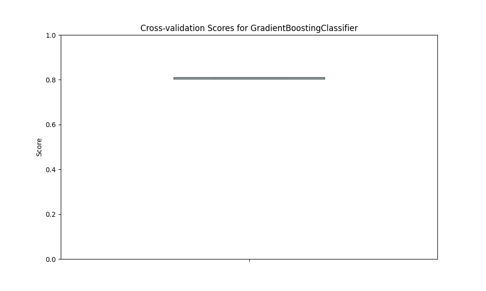
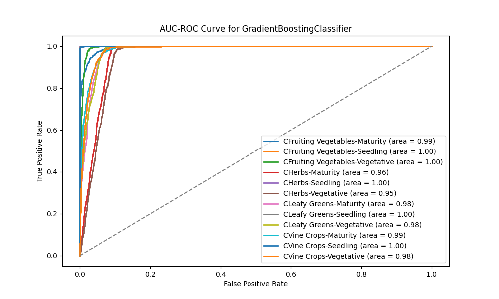
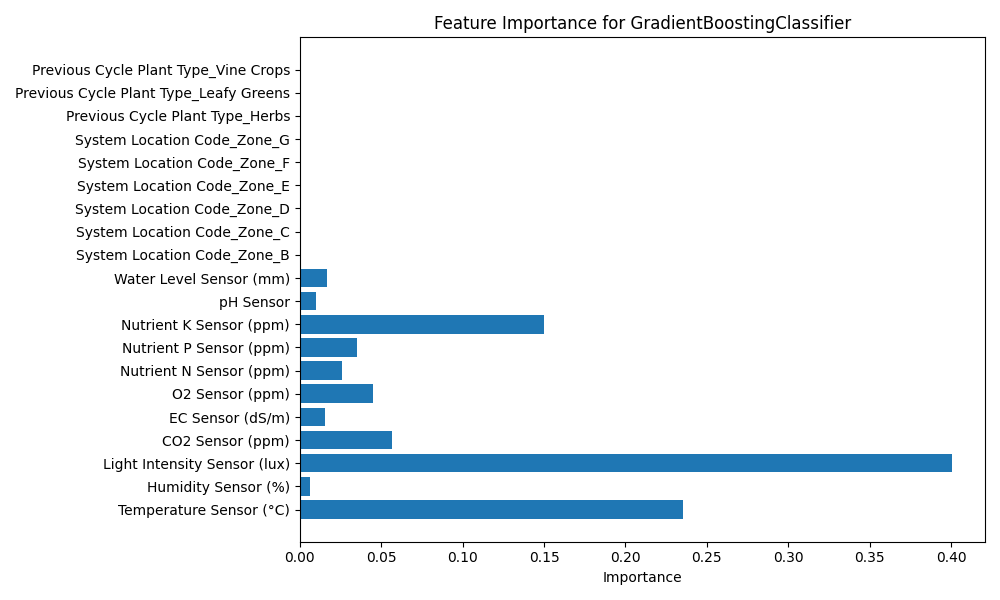

### Name and email
Name: Tan En Yao

Email: t.enyao93@gmail.com

### Overview of folder structure
```
AIAP
│
├── .github
├── src/                  (Source code directory)
│   ├── main.py           (Main Python script) 
│   ├── pipe.py           (Pipeline script)  
│   ├── config.py         (Configuration settings)
│   ├── query.py          (Dataset query)
├── images/               (Visual results from MLP)
├── README.md             (Project documentation)
├── eda.ipynb             (Jupyter notebook)
├── requirements.txt      (Python dependencies)
├── run.sh                (Shell script)
```

### Instruction for executing the pipeline and modifying parameters
To run the pipeline, double click on the the bash script (run.sh).

To experiment with different algorithms and parameters, 
1. Add the algorithm name and their parameters to `param_grid` in *src/config.py*
2. Import the model and initialize it in the `self.models()` method in the `ModelEvaluation` class found in *src/model_evaluation.py*

To remove algorithms and parameters, comment out the algorithms and their parameters in *src/config.py*.

### Description of flow of the pipeline

1. Data cleaning
- *Converting column types:* Ensures that data types are correctly interpreted for downstream processing and analysis
- *Impute missing data:* Fills in missing values to maintain dataset completeness and prevent biases
= *Handle erroneous data:* Identifies and corrects incorrect, inconsistent, or implausible data points to improve the reliability and accuracy of analyses and models
- *Removing duplicates:* Eliminates redundant rows to prevent bias and overrepresentation of certain data points
- *Removing outliers:* Filters outliers to reduce skew in the data distribution 
- *Feature selection:* Chooses only relevant features to improve model efficiency

2. Define models
- *Classifier model:* Specifies the model type to be trained on

3. Create RandomSearchCV object
- *Param_grid:* Specifies the range of hyperparameters for optimizing model performance
- *Cross validation:* Evaluates the model on multiple test sets to provide a more reliable estimate of model performance on new, unseen data
- *Make predictions:* Predictions are generated on a test or hold-out set to evaluate model performance

4. Compute and print performance
- *RSME:* Quantifies the model's prediction error by measuring the square root of the average squared differences between predicted and actual values, providing insight into the magnitude of errors
- *R-squared:* Evaluates the proportion of variance in the dependent variable that the model explains, indicating the goodness of fit
- *Precision:* Measures the model's accuracy in correctly identifying positives
- *Recall:* Measures model's ability to capture all true positives
- *F1 score:* Provides a balanced score that accounts for both precision and recall
- *ROC AUC score:* Measures the model’s ability to distinguish between classes across different thresholds
- *Confusion matrix:* Summarizes classification results, showing true positives, true negatives, false positives, and false negatives

5. Visualise model performance
- *Box plots:* Show cross-validation score distributions
- *ROC AUC curve:*  Visualizes the relationship between the true positive rate and false positive rate across thresholds
- *Feature Importance:* Highlights the relative contributions of each feature in making predictions, helping to identify which variables are most influential in the model's decision-making process.
- *Predicted vs Actual:* A plot that compares the predicted values from a model against the actual observed values, often used in regression analysis. It helps assess the model's accuracy and identify patterns

### Overview of key findings from the EDA 
- **Identified object dtypes for Nutrients N, P, K:**
    - In both regression and classification tasks, the model cannot utilize numerical data stored in object format. This results in a loss of valuable information, negatively impacting its ability to generalize effectively, whether predicting continuous (regression) or categorical (classification) outcomes.
- **Identified negative values in Light Intensity, EC, and Temperature:**
    - **Regression:** Negative values in continuous variables (Light Intensity, EC, Temperature) distort the relationships between inputs and target values, leading to inaccurate predictions.
    - **Classification:** Negative values can skew class distributions, impairing the model's ability to properly distinguish between categories.
- **Identified case variants in Plant Type and Plant Stage:**
    - **Classification:** Inconsistent casing in categorical variables like Plant Type and Plant Stage leads to false patterns being learned, diminishing the model's ability to generalize to unseen data.
- **Identified missing values in data:**
    - In both regression and classification tasks, missing values lead to loss of information. Dropping rows or columns with significant missing data can impair the model’s ability to generalize effectively.
- **Identified duplicate rows in data:**
    - In both regression and classification, duplicate rows skew model learning, causing overfitting and reducing the model's ability to generalize. Excessive influence from duplicates can introduce bias into the learned patterns.
- **Identified skewed and multimodal distributions in numerical data:**
    - **Regression:** Skewed distributions can lead to over-prediction or under-prediction in certain ranges, affecting the model's accuracy
    - **Classification:** Skewed or multimodal distributions can mislead the model by distorting class boundaries, decreasing its accuracy in correctly identifying categories.
- **Identified non-linear decision boundaries**
    - **Classification:** The presence of non-linear decision boundaries invalidates the use of linear models, which fail to capture complex relationships in the data.
- **Identified weak correlation between features and target variable:**
    - **Regression:** A weak correlation between features and the target variable suggests that linear models may be ineffective, as they rely on stronger relationships between inputs and outputs. This can lead to poor model performance.
- **Identified balanced feature and target classes:**
    - **Classification:** Balanced classes enables the model learns to treat all classes equally, without bias towards a majority class. This helps the model perform well across all categories, preventing any class from being underrepresented or neglected during training.
    
### Describe how features in the dataset are processed

| Process                     | Description                                                                                       |
|---------------------------- |---------------------------------------------------------------------------------------------------|
| Datatype conversion         | Convert object to numerica dtype                                                                  |
| Standardise case variants   | Convert categories to title format                                                                |
| Removed negative values     | Removed erroneous negative values                                                                 |
| Impute Missing Values       | Replace missing values in features using prediction models                                        |
| Remove duplicate rows       | Remove duplicated rows in the dataset                                                             |
| Remove outlier              | Remove data points that do not make sense based on domain knowledge                               |
| One-hot encoding            | Converts categorical data into binary format                                                      |
| Label encoding              | Converts target data into numerical format                                                        |
| Removing redundant features | Eliminating features that do not provide new or useful information                                |

### Explanation of your choice of models 

<ins>**Model selection criteria**</ins>
- **Problem context**
    - **Regression:** To predict the temperature conditions
    - **Classification:** To categorise the combined "Plant Type-Stage" based on sensor data
- **Data characteristics**
    - **Regression:** Linearity, multicollinearity. Weak correlation between features and the target may suggest the need for non-linear models
    - **Classification:** Balanced or imbalanced classes. Imbalanced classes can lead to biased predictions, so strategies like resampling or adjusting class weights will need to be considered in such cases
- **Evaluation metrics**
    - **Regression:** RMSE, R-squared
    - **Classification:** Accuracy, Precision/Recall

<ins>**Alternative models**</ins>
- **Regression:**
    - **Linear models:** Linear regression, Ridge/Lasso regression for modelling linear relationships
    - **Tree models:** Decision tree, Random forest, Gradient boosting for handling complex, non-linear relationships
    - **Others:** K-nearest Neighbors can work for regression but may struggle with skewed or multimodal data
- **Classification:**
    - **Linear models:** Logistic regression, Linear Discriminant Analysis for linear classification tasks
    - **Tree models:** Decision tree, Random forest, Gradient boosting for complex classification tasks
    - **Others:** K-nearest Neighbors works for classification but may struggle with skewed or multimodal data

<ins>**Exploratory Data Analysis (EDA)**</ins>
 - **Regression:**
     - **Correlation matrix** shows weak correlation which indicates that linear models might not be the best
     - **Feature distribution** shows skewed and multimodal distributions that can affect models like K-nearest Neighbors because the model is sensitive to the distance between points
        - Skew creates biased predictions towards a region, ignoring the sparse regions
        - Multimodality results in inappropriate neighbour selection
 - **Classification:**
     - **Hue scatterplots** show complex boundaries and invalidates linear models that assume a simple, linear separation between classes
     - **Feature distribution** shows skewed and multimodal distributions that can affect models like K-nearest Neighbors because it relies on the distance between points
        - Skew creates a bias decision boundary, leading the model to disproportionately favor the dense regions
        - Multimodality results in inappropriate neighbour selection, which leads to incorrect neighbor selection and poor model performance

### Evaluation of the models developed

<ins>**Domain-specific priorities**</ins>
- **For predicting temperature:** Minimizing large errors is key(under- or overestimation): Large errors in predictions can lead to either excessive cooling or heating, which could result in wasted energy or suboptimal conditions for plant growth. It’s crucial to minimize these large errors to ensure precise control over the environment.
- **Classifying Plant Type-Stage:**
    - **Favor recall** if misclassification leads to severe crop loss. E.g. Missing plants in a disease-prone stage could lead to widespread crop loss
    - **Favor precision** if false positives result in wasted resources. E.g.  If resources like water or fertilizer are limited, it’s more important to ensure that only plants genuinely in need receive those resources

<ins>**Metric selection**</ins>
- **Regression**
    - Mean Squared Error (MSE) or Root Mean Squared Error (RMSE): These metrics evaluate the average magnitude of error. RMSE is particularly useful as it gives higher weight to larger errors, which is crucial for controlling temperature precisely.
    -  R-Squared: This metric may also be used to indicate the proportion of variance in the temperature data explained by the model. A higher R-squared value indicates a better fit and more accurate predictions.
- **Classification**
    - In a balanced dataset, accuracy might be good enough, but precision and recall might offer more insight later on, especially if there are false positives or false negatives that matter.
    - F1 score may be used as a balance between precision and recall, or a ROC-AUC if the main concern is about the ability to rank predictions correctly.

<ins>**Evalution of Decision Trees, Random Forest, and Gradient Boosting for Regression**</ins>

<ins>**Predicted versus Actual**</ins>

- **Decision Tree:** The scatterplot is more fragmented with piecewise predictions, indicating higher risk of overfitting, and potential for larger errors.
- **Random Forest:** Has a smoother scatterplot with less variance, indicating better generalization and reduced overfitting.
-**Gradient Boost:** Scatterplot is tightly concentration around the diagonal, suggesting accurate predictions and reduced bias, but might exhibit minor overfitting in noisy data.


<ins>**Visualising Cross validation Score**</ins>

- A narrow box indicates low variance in model performance, meaning that the model is generalizing well to different subsets of the data. However the median score is around 0.5, so the model is performing moderately well, but there could be room for improvement.


<ins>**Feature importance**</ins>

**Top features**
- **Light Intensity:** This is expected to have a significant impact on the model sinc higher light intensity increases the temperature of plant tissues and the surrounding environment. Plants exposed to strong light sources often experience higher internal temperatures

- **Nutrient K:** Potassium has a significant impact on the model since it plays a critical role in photosynthesis which is exothermic (produces heat), so plants in environments with adequate potassium might experience a higher rate of energy absorption and heat production.

**Low importance Features**
- **pH and EC:** pH and EC are mainly for plant nutrition and overall health, they do not directly influence the temperature of a plant growth environment. Temperature is more directly impacted by factors like light intensity, humidity, and nutrient availability (e.g., potassium)


   

<ins>**Evalution of Decision Trees, Random Forest, and Gradient Boosting for Classification**</ins>

<ins>**Confusion matrix**</ins>

- The diagonal elements of the confusion matrix represent the correct predictions (True Positives) for each class. A well-performing model should have high diagonal values, indicating that the model is accurately classifying instances of each class.
- The off-diagonal elements represent misclassifications, where the model incorrectly predicted a class for a sample.
- For the case of both Herbs and Leafy Greens, the model misclassifies the maturity class for the vegetative and vice versa. This overlap may suggest that these classes have similar features or overlap in their characteristics, making them harder for the model to distinguish.


<ins>**Visualising Cross validation Score**</ins>

- A narrow box with a CV score around 0.8 suggests that the model has strong, stable, and consistent performance across the different folds of cross-validation. It also indicates low variance in model performance, meaning that the model is generalizing well to different subsets of the data.




<ins>**AUC ROC**</ins>

- **Decision Trees:** Display a lower AUC that can be due to overfitting and sensitivity to small changes in data, resulting in less distinct separation between classes
- **Random  Forest:** High AUC than decision trees due to the ensemble method which helps reduce overfitting and improve generalisation
- **Gradient Boosting:** Yields the highest AUC among the three, as it minimizes both bias and variance through sequential learning and error correction.




<ins>**Feature importance**</ins>

**Top features**
- **Light Intensity:** Light intensity is a crucial factor in classifying plants because it influences their growth patterns, photosynthetic processes, stress tolerance, and adaptation to environmental conditions. By understanding how plants respond to varying light intensities, we can group them into categories such as sun-loving plants, shade-tolerant plants, or light-demanding plants.
- **Temperature:** This is expected because temperature is an effective in classifying plants because it plays a major role in determining plant survival, growth, and reproduction. Asessing the temperature tolerance and preferences of plants can help classify them into types or categories based on their environmental needs.
- **Nutrient K:** Potassium is important for classifying plants because it influences a variety of essential functions such as growth, reproduction, stress resistance, and photosynthesis. By assessing potassium requirements, you can classify plants based on their environmental adaptation, growth stages, and nutrient uptake efficiency.

**Low importance Features**
- **Humidity:** Humidity is not as effective as the top features because plants are adapted to a wide range of humidity conditions, and many species can tolerate a variety of humidity levels depending on other factors such as soil moisture and temperature. Some plants may thrive in high humidity but can also tolerate moderate humidity if they are in environments with adequate water and temperature conditions.
- **pH:** most plants can tolerate a range of pH values and can adjust their growth accordingly. While some plants are more adapted to acidic (e.g., blueberries), neutral (e.g., vegetables), or alkaline soils (e.g., lilies), many plants exhibit a wide tolerance for pH levels and are not strictly bound to one specific range.




<ins>**Limitations of Decision Trees, Random Forest, and Gradient Boosting in Regression and Classification**</ins>
- **Decision Trees:** 
    - **Complex decision boundaries** can cause overfitting, this can be mitigated by limiting tree depth or setting a minimum number of samples per leaf. this process is also called pruning.
    - **Small changes** to data can lead to large change in the tree structure, this can be mitigated by using ensemble methods like random forest where the instability is reduced by aggregation.
- **Random Forest:** 
    - **Too many trees** and complex decision boundaries can also cause overfitting, this can be mitigated by tuning the model hyperparameters like the number of trees (n_estimators) and maximum tree depth (max_depth)
    - **Lack of interpretability** because of the many trees in use, this can be mitigated by using simpler models like decision trees for interpretability if needed
- **Gradient Boost:**
    - **Too many boosting rounds** may lead to overfitting, this can be mitigated by using early stopping or by limiting the number of boosting rounds (n_estimators)
    - **Computationally expensive** training leads to long training times, however limiting complexity (max_depth, n_estimators) can help to speed things up 

### Other considerations for deploying the models developed

<ins>**Feature Engineering**</ins>
- **Encoding:**
    - **For classification:** Categorical inputs (like Plant Type and Plant Stage) require encoding for the model to use the data effectively.
- **Removing Redundant Features:**
    - **For regression:** Redundant features often lead to multicollinearity, where predictor variables are highly correlated. This can distort the relationship the model makes between predictors and the target variable and lead to overfitting.
    - **For classification:** Redundant features can create overly complex decision boundaries and cause the model to overfit to noise rather than generalizable patterns.

<ins>**Data processing Strategies**</ins>
- **Imputing Missing Data:**
    - **For both regression and classification:** Filling in missing data preserves valuable information that would otherwise be lost if rows or columns were dropped. This helps maintain the integrity of the dataset, enabling the model to learn from a complete set of patterns and generalize more effectively to unseen data.
- **Correcting Erroneous Data:**
    - **Regression:** Correcting erroneous data is crucial to prevent the model from creating unnecessary or inaccurate splits, ensuring more reliable and accurate predictions.
    - **Classification:** Removing or correcting erroneous data ensures accurate class boundaries, enabling the model to effectively differentiate between categories and improve overall performance.
- **Handling duplicate rows in data:**
    - **For both regression and classification:** Eliminating duplicate rows is crucial in both regression and classification tasks to ensure unbiased model learning. Retaining duplicates can distort the training process by over-representing specific patterns, leading to overfitting and reducing the model's ability to generalize effectively to unseen data.
- **Addressing Object Data Types for Nutrients N, P, K:**
    - **For both regression and classification:** Converting numerical data stored in object format to a usable numeric type is essential for both regression and classification tasks. Without this step, the model cannot process the data effectively, leading to a loss of critical information and reduced generalization performance for predicting both continuous and categorical outcomes.

